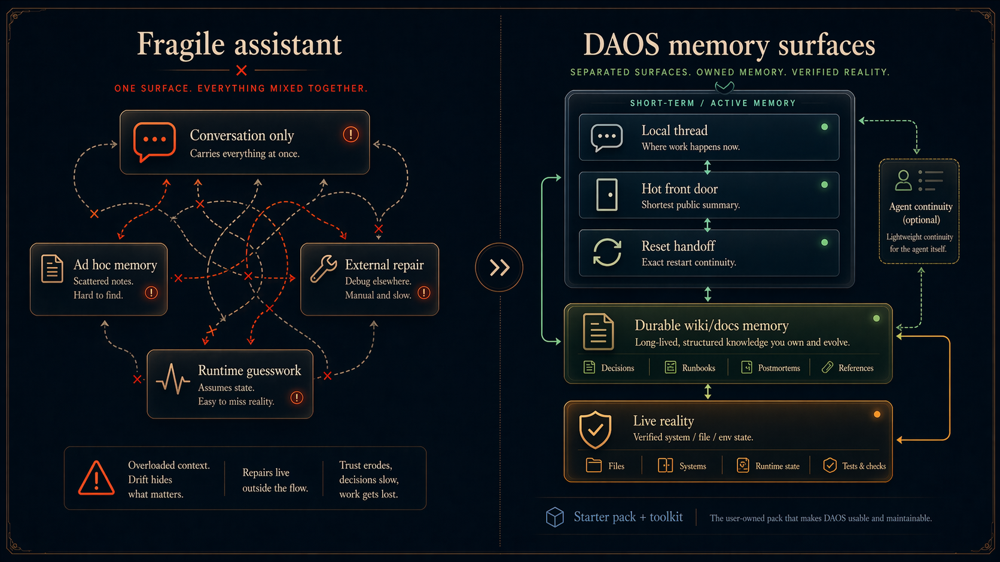
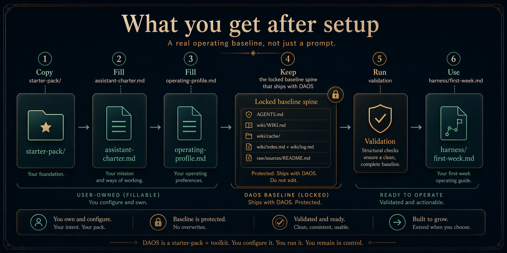

# Durable Assistant OS

**Release discipline:** pre-1.0 semver with `CHANGELOG.md` as the source of truth for framework-facing changes.
**Current documented baseline:** `v0.1.4`; use `CHANGELOG.md` and `docs/releases/` for release notes.

Durable Assistant OS (DAOS) is a starter pack + toolkit for building assistants that stay useful over time instead of degrading into drift, clutter, and maintenance burden.

It gives you a structured assistant operating pack plus docs and scripts for keeping memory, trust, and upkeep from falling apart over time.

It is strongest today as:
- a methodology for durable assistant operation
- a tooling kit for generating, validating, updating, and porting that structure

It is **not** yet a full runtime integration layer by itself.

## Who this is for

DAOS is most useful if you are:
- already using assistants enough to feel the pain of context drift, memory clutter, and upkeep overhead
- configuring a serious assistant for yourself, another person, or a team
- trying to build a repeatable assistant operating pack instead of relying on ad hoc prompting alone

## Who this is not for

DAOS is probably not for you if:
- you are just setting up OpenClaw or another assistant runtime for the first time and mainly want a simple first-run experience
- you want a plug-and-play consumer app with almost no setup or operating discipline
- you do not want to keep any markdown/wiki-style operating surface at all

## If you're new, do this first

If you only try one thing here, copy `starter-pack/`.

1. Copy `starter-pack/` into your own workspace.
2. Fill `assistant-charter.md` and `operating-profile.md`.
3. Run `python scripts/daos_validate.py /path/to/my-daos-pack`.
4. Use `harness/first-week.md` once the baseline is live.

If you want the fuller walkthrough after that, read `docs/quickstart.md`.

What is already included in `starter-pack/`:
- the fillable operator files (`assistant-charter.md`, `operating-profile.md`, optional `lane-snapshot.md`, later `cadence-review.md`)
- the locked mandatory baseline spine (`AGENTS.md`, `wiki/WIKI.md`, `wiki/cache/`, `wiki/index.md`, `wiki/log.md`, `wiki/raw/README.md`, `wiki/sources/README.md`)

You do not need to author those locked baseline files from scratch. They already ship in the starter pack.

## What you should have after one sitting

After the first setup, you should have:

- a clear definition of what your assistant is for
- explicit trust and approval boundaries
- a durable place for key working context
- a simple structure for keeping active work from drifting
- a locked baseline memory/doctrine spine already written into the pack

Want to see what a filled pack looks like? Start with `examples/creative-studio-operating-profile-example.md`.

If this problem sounds familiar, start with `starter-pack/` and ignore the rest until you need it.

## Why DAOS exists

Most assistants do not fail at setup.
They fail once upkeep starts costing more than the help is worth.

Memory gets noisy, context drifts, trust drops, and the user ends up maintaining the assistant more than using it.

DAOS exists to reduce that degradation and make assistants more usable, trustworthy, and repairable over time.

## The simple mental model

DAOS tries to stop assistant memory and context from collapsing into one blurry pile.

It separates:
- **the local thread** — what is being asked right now
- **a hot front door** — the shortest shared summary of what matters now
- **a reset handoff** — the exact next move after reset or long idle
- **durable wiki/docs memory** — what should survive and be shared
- **live reality** — the files, systems, and runtime state that must be checked before acting

If you want the fuller explanation, read `docs/public-memory-page.md` first and `docs/memory.md` only after that.
If you care specifically about keeping durable wiki pages structured and trustworthy over time, read `docs/wiki-governance.md`.

If you want the specific wake-up continuity surface, read `docs/reset-handoff.md`.

## Start here first

Before you dive into DAOS, read:

- **Karpathy's LLM Wiki pattern**  
  https://gist.github.com/karpathy/442a6bf555914893e9891c11519de94f

It is the easiest way to understand the core idea behind DAOS memory:
keep durable knowledge in a maintained markdown wiki instead of trying to recover everything from chat history every time.

Optional companion:
- **Obsidian** — useful if you want a clean, human-friendly way to browse and edit that wiki  
  https://obsidian.md/download

Short version:
- read Karpathy first to understand the model
- use Obsidian later if you want a better UI for the wiki

## Try DAOS

Most people should use the default path below and ignore the alternates.

**Recommended default:** copy `starter-pack/` first.
It is the simplest way to understand DAOS and get a usable baseline quickly.

### Default path — Copy the ready-made pack
Best if you want the most literal first run.
1. Copy `starter-pack/` into your own workspace.
2. Open `starter-pack/README.md` and fill the files in that order.
3. Run `python scripts/daos_validate.py /path/to/my-daos-pack`.
4. Use `harness/first-week.md` once the baseline is live.

### Alternate path — Generate a new pack
Best if you want a clean generated scaffold.
1. Run `python scripts/daos_bootstrap.py /path/to/my-daos-pack`.
2. Fill the generated files.
3. Run `python scripts/daos_validate.py /path/to/my-daos-pack`.
4. Use `harness/first-week.md` once the baseline is live.

### Alternate path — Use the guided wizard
Best if you want the repo to walk you through setup.
1. Run `python scripts/daos_wizard.py /path/to/my-daos-pack`.
2. Review/fill anything still missing.
3. Run `python scripts/daos_validate.py /path/to/my-daos-pack`.
4. Use `harness/first-week.md` once the baseline is live.

Default path rule:
- operate from `starter-pack/` or a generated pack
- use `templates/` only when you are extending or reusing framework blanks

## What the repo gives you today

### Start here
- `docs/quickstart.md` — fastest path to first value
- `docs/public-memory-page.md` — the memory model in plain English
- `docs/adoption-path.md` — what to do after first install

### Core doctrine
- `docs/thesis.md` — why DAOS exists
- `docs/memory.md` — deeper memory doctrine
- `docs/reset-handoff.md` — named reset/wake-up continuity artifact and runtime contract
- `docs/trust.md` — behavior and trust posture
- `docs/setup.md` — setup philosophy
- `docs/lane-model.md` — lane framing

### Optional runtime-specific installs
- `docs/agent-integrations.md` — optional runtime-specific install layer (Hermes first)

### Working surfaces
- `starter-pack/` — default copyable operating instance, now including locked baseline wiki/cache doctrine files and the public `wiki/cache/reset-handoff.md` artifact
- `templates/` — reusable source blanks
- `examples/` — worked examples, including non-Carlton-shaped profiles such as a creative studio
- `harness/core-setup.md`, `harness/mandatory-baseline.md`, and `harness/first-week.md` — install + stabilization guidance

### Tooling
- `scripts/daos_bootstrap.py` — generate a blank or filled pack
- `scripts/daos_wizard.py` — interactive generated setup
- `scripts/daos_validate.py` — operability + lint/calibration checks
- `scripts/daos_update.py` — safe in-place pack inspection/apply
- `scripts/daos_portability.py` — wiki-first export/inspect/plan/apply for durable memory portability

## Suggested reading order

Use this lighter path instead of reading the whole repo front to back:
1. `docs/quickstart.md`
2. `docs/public-memory-page.md`
3. `docs/adoption-path.md`
4. `docs/thesis.md`
5. `docs/memory.md` only if you want the deeper doctrine
6. `docs/pack-schema.md` or `docs/portability.md` only if you need those mechanics

## One-line repo map

- `docs/` explain
- `harness/` guide real use
- `starter-pack/` is the default operating surface, including locked baseline doctrine files plus fillable operator-owned files
- `templates/` are source blanks
- `examples/` demonstrate filled outcomes
- `scripts/` generate, validate, update, and port

## Near-term direction

Current focus:
- tighten the front door
- reduce doc sprawl
- make examples easier for outsiders to map onto their own work
- avoid expanding the control surface unless real usage proves the need

## Public-framework hygiene

Baseline hygiene present:
- Apache-2.0 license
- contribution guidance
- security reporting guidance
- basic ownership/ignore files

## Commit checkpoints

Use commits at coherent checkpoints, not after every tiny edit.

Commit when all three are true:
- one repo-facing slice is coherent
- the public/private boundary for that slice is stable
- the change can be described with one clean commit message
