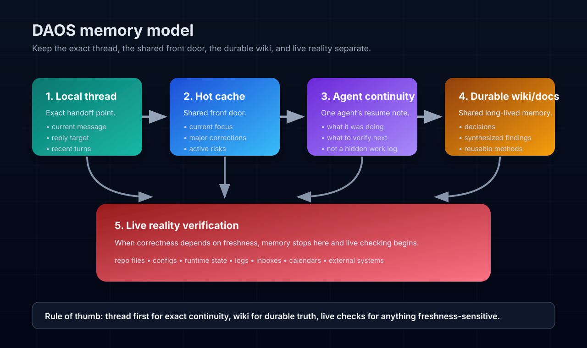

# DAOS Public Memory Model

## The shortest explanation

DAOS tries to stop assistant memory from collapsing into one blurry pile.

It keeps five things distinct:
- **local thread** — what is being asked right now
- **hot cache / active front door** — what matters now across active work
- **reset handoff** — the exact next move after reset or long idle
- **durable wiki/docs memory** — what should survive and be shared
- **live reality** — files, systems, and runtime state that must be checked before acting

If you only need the public framing, this page is enough.
If you want the deeper doctrine, then read `memory.md`.
If you want the exact reset/wake-up artifact, read `reset-handoff.md`.

## The practical read order

When recovering context, DAOS prefers:
1. **local thread first**
2. **hot cache second**
3. **hot-cache log next when the front door feels incongruent**
4. **reset handoff after that when resuming after reset or long idle**
5. **agent continuity after that if still needed**
6. **deeper durable memory after that**
7. **live verification whenever current reality matters**

This keeps the assistant responsive to the exact conversation without pretending old notes are always current.

These are operating layers, not mandatory built-in DAOS runtime components.

## What each layer is for

### 1) Local thread
Use this for the exact handoff point:
- the current message
- any reply target
- the last few turns in the active session

This usually wins when active-memory surfaces disagree.

### 2) Hot cache / active front door
Use this as the shared quick-orientation layer:
- current focus
- important corrections
- active risks
- the smallest useful summary of what matters now

This should stay short.
It is not meant to become a second wiki.

### 3) Reset handoff
Use this for the exact post-reset resume point:
- the next concrete move
- the first thing to verify
- the narrow handoff that should survive one reset or long idle gap

This should stay overwritten and compact.
It is not a log and not a substitute for durable memory.

### 4) Agent continuity
Use this when one specific agent needs help resuming its own lane.

Its job is narrow:
- what that agent was last doing
- the next concrete move when resume ambiguity is real
- what it should verify before continuing

It should not replace the local thread or become a hidden work log.
Not every DAOS install needs a formal continuity note on day one.

### 5) Durable wiki/docs memory
Use this for knowledge that should survive:
- stable definitions
- durable decisions
- synthesized findings
- reusable methods
- public/project-facing documentation

This is where the cumulative value should live.

### 6) Live reality
Use this whenever correctness depends on what is true now:
- repo files
- runtime state
- configs
- inboxes
- calendars
- logs
- external systems

Remembered context can be useful and still be wrong.
That is why DAOS makes a hard distinction between memory and source-of-truth reality.

## The behavioral rule underneath it

The point is not to remember everything.
The point is to:
- keep the right foreground live
- preserve the right durable truths
- verify reality before acting when stakes depend on freshness
- compress memory before it turns into clutter

## Volatility in multi-lane systems

Shared front-door memory is useful, but it is intentionally volatile.

The main reason is not only multiple agents.
It is that multiple lanes can compete for the foreground.
As the active lane changes, the shared front door may be rewritten or re-scoped even if only one agent is operating.
Multiple agents can intensify that churn, but lane pressure is the deeper cause.

That means active/front-door memory should not be treated as the sole durable home for:
- important findings
- meaningful clarifications
- cross-lane decisions
- anything another agent or future session would be annoyed to reconstruct

Those belong in a more stable layer such as the durable wiki/docs memory surface.

## Why Obsidian and the LLM Wiki pattern matter

DAOS strongly fits a markdown-wiki workflow.

## How these layers usually map in practice

- local thread → the current chat/session context
- hot front door → a short active summary or current-state note
- reset handoff → a named post-reset wake-up note such as `wiki/cache/reset-handoff.md`
- agent continuity → an optional resumable note for one agent or one lane
- durable wiki/docs memory → markdown pages in a repo, wiki, or vault
- live reality → files, tools, systems, and logs checked at action time

Recommended companions:
- **Obsidian** — browse and edit the durable memory surface as a real vault  
  https://obsidian.md/download
- **Karpathy's LLM Wiki pattern** — the clearest public statement of the persistent wiki approach  
  https://gist.github.com/karpathy/442a6bf555914893e9891c11519de94f

A good shorthand is:
- the wiki is the durable codebase
- Obsidian is the easiest operator-facing window into it
- the assistant maintains and uses it, but should not confuse it with live runtime truth

## Bottom line

DAOS memory is meant to become clearer as it matures, not heavier.

If a layer keeps growing but does not make the assistant more useful, more trustworthy, or less repetitive, it is drifting.
